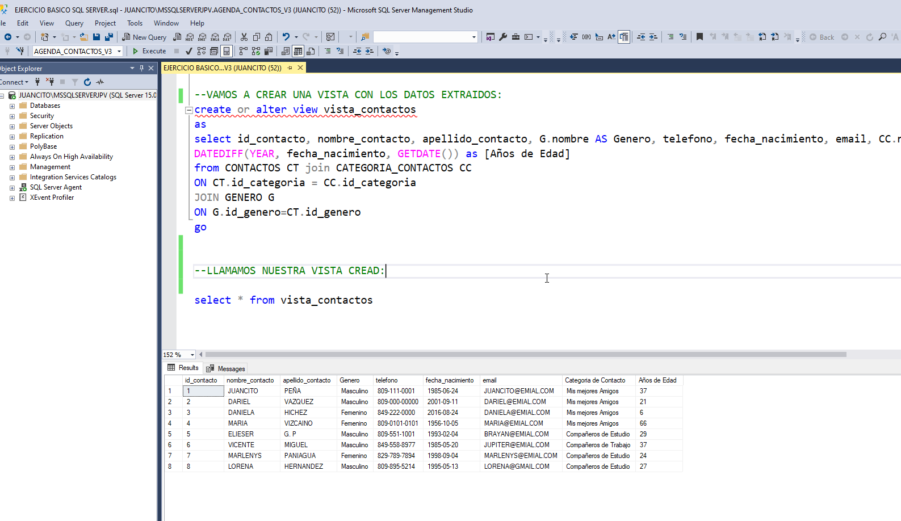

# SCRIPT_BASICO_SQL_SERVER
PARA YOUTUBE - MANUAL INSTRUCCION BASICAS DE SQL SERVER - CRUD- Y MAS

En un video anterior vimos algunas informaciones de SQL Server, y hablamos que es un motor de Base de Datos Gratuito en su versión Express y Developer, que permite almacenar información ordenada y estructurada de manera tal que pueda ser consultada rápidamente. Puede ser utilizado para Crear las bases de datos de varios Sitios Web, Aplicaciones para dispositivos móviles, aplicaciones de Escritorio o bien para almacenar datos de un Videojuego o cualquier aplicación o software empresarial como inventarios, facturas, contabilidad, etc.

Realizamos unos Ejercicios Basicos, y hoy vamos a seguir aprendiendo algunos conceptos básicos como son las relaciones, un ejemplo basico de Normalizacion, y como podemos crear 3 tablas y hacer una relación entre ellas por medio de un campo en común, y veremos como responder preguntas que me pueden hacer y que puedo contestar con SQL Server, y usos de Funciones como Count, Funciones de Fecha como DATEDIFF, asi como crear unas consultas combinadas con Join, y creacion de una vista.

## VIDEO EN YOUTUBE DEL EJEMPLO:

[EJERCICIOS Y CONSULTAS BASICAS DE SQL BASICAS, TABLAS Y RELACIONES Y VISTAS](https://www.youtube.com/watch?v=yMv8ks9rvRo)
